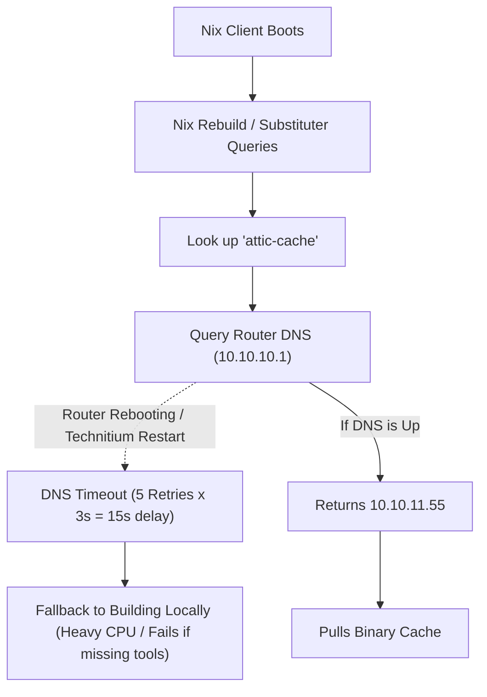
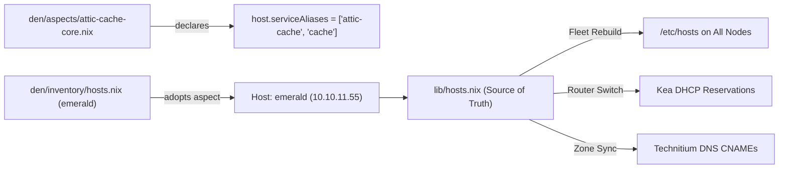

# Fleet DNS & Host Alias Architecture: Research & Best Practices

## Executive Summary

Relying exclusively on centralized DNS (Technitium / Bind / Unbound) for core internal infrastructure components introduces **bootstrap deadlocks**, **substituter query delays**, and **flapping failure modes** during network reboots or node migrations.

Adopting a **dual-tier declarative resolution model**—combining fleet-wide declarative `/etc/hosts` generation with dynamic split-horizon DNS—is standard enterprise practice (seen in Kubernetes, Consul, and large-scale NixOS deployments).

---

## 1. The Core Infrastructure Problem: Bootstrap Deadlocks

In infrastructure-as-code environments, a circular dependency frequently emerges:

### What Happened During Migration 02:
1. `attic-cache` was migrated from LXC `10.10.11.39` to baremetal node `emerald` (`10.10.11.55`).
2. Client `/etc/nix/nix.conf` still held `http://10.10.11.39:5001/cache-local`.
3. Technitium had a CNAME collision and crashed during static zone sync.
4. Clients querying unqualified `attic-cache` without explicit search domain failed resolution with `NXDOMAIN`.
5. Every single `nix` command timed out waiting for the old IP.

---

## 2. Industry Best Practices: Dual-Tier Resolution

Enterprise systems (Kubernetes, AWS VPC, systemd-resolved, HashiCorp Consul) address this through a formal **dual-tier model**:

| Tier | Component | Authority | Latency | Resilience |
| :--- | :--- | :--- | :--- | :--- |
| **Tier 1 (Infallible Local)** | `/etc/hosts` via `networking.hosts` | Core node identities, static infrastructure services, aspect aliases (`attic-cache`, `router`, `storage`) | **0.0 ms** (in-kernel `/etc/hosts` lookup) | 100% offline, survives router reboot, works in chroots & containers |
| **Tier 2 (Dynamic Network)** | Technitium DNS + Kea DDNS (RFC 2136) | Dynamic client leases, IoT devices, guest VLANs, reverse PTR zones, public subdomains | **1–5 ms** | Dynamically updated upon DHCP lease grant |

### Key Precedents:
- **Kubernetes Pod `hostAliases`**: Kubernetes specifically injects `/etc/hosts` entries into containers so pods can communicate with core services without waiting for or overloading CoreDNS.
- **NSS Ordering (`nsswitch.conf`)**: POSIX and systemd standardize `hosts: files mymachines myhostname resolve [!UNAVAIL=return] dns`. `files` (`/etc/hosts`) is always consulted first.
- **RFC 1123 (§6.1.3.8)**: Local host tables must be maintained for essential system identity and fallback operation.

---

## 3. The Aspect Service-Alias Pattern

A core tenet of the Dendritic / Aspect architecture is separating **Substrate Identity** from **Functional Capability**:

- **Substrate Node Identity**: Physical MAC, motherboard, CPU features, disk layout (`emerald`, `phoenix`, `router`).
- **Functional Aspect Identity**: Services provided by aspects (`attic-cache`, `paperless`, `nightscout`, `builder`).

### Declarative Propagation Flow:

### Why Declarative `/etc/hosts` is Safe & Proper in NixOS:
Unlike mutable Debian/Ubuntu servers where `/etc/hosts` easily drifts into unmaintainable sprawl, in NixOS `/etc/hosts` is:
1. **Fully Declarative**: Managed entirely by `networking.hosts` generated from `lib/hosts.nix`.
2. **Centrally Versioned**: A change to a node IP or alias in `lib/hosts.nix` propagates synchronously to all nodes.
3. **Collision-Free**: Generated with deduplication (`lib.unique`) and fully qualified domain names (`<name>.deepwatercreature.com` + `<alias>.deepwatercreature.com`).
4. **Instant Bootstrap**: When a new node installs via `nixos-anywhere`, it immediately has full LAN name resolution before the router DNS has even seen its DHCP lease.

---

## 4. Multi-NIC Route Metric Discipline

When workstations (`phoenix`) or servers have multiple active network cards connected to the same switch:
- Each interface receives a DHCP lease if configured with `DHCP = "yes"`.
- If route metrics are not explicitly configured, the kernel / NetworkManager chooses default routes based on enumeration order (e.g. onboard 1GbE `enp78s0` metric 102 vs. 10GbE SFP+ `enp83s0f0np0` metric 104).
- **Rule**: High-speed dedicated SFP+/10GbE interfaces must explicitly set `ipv4.route-metric = 50`, ensuring outbound traffic always uses the inventory-assigned static IP (`10.10.11.92`).
