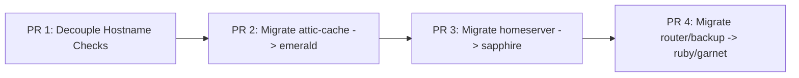

# Host Naming and Dendritic Role Migration Plan

## Context and Purpose

Historically, machines in this homelab were named directly after their primary functional role (e.g. `router`, `attic-cache`, `homeserver`), deployed as LXC containers or QEMU VMs in Proxmox.

While functional naming is intuitive for small initial deployments, it couples the **substrate identity** of a machine (Proxmox VM ID, MAC address, DHCP lease, disk layout, agenix host key, `/etc/ssh/ssh_host_ed25519_key`) with the **workloads** running on it. This creates friction when:
- Services need to migrate to different nodes or hardware without breaking external consumers.
- Multiple roles are consolidated onto a single node (e.g. `homeserver` running home automation, semaphore, and roundtable).
- Nodes are replaced, upgraded, or failed over.

This plan defines the architectural transition to **node-identity hostnames** (following a mineral/gemstone convention like `emerald`, `ruby`, `sapphire`, `garnet`, alongside the existing `phoenix`), delegating all functional roles to the repository's **dendritic pattern (`den/`)** and preserving operator/service access via **DNS CNAME aliases** and **SSH host aliases**.

---

## Architectural Principles

### 1. Three-Layer Separation

| Layer | Responsibility | Source of Truth | Example |
|---|---|---|---|
| **Substrate / Node Identity** | Physical/virtual instance, MAC, IP, hardware/disko, agenix keys | [`lib/hosts.nix`](file:///home/deepwatrcreatur/flakes-worktrees/unified-nix-configuration/main/lib/hosts.nix), `den/hosts/<name>/` | `emerald` (10.10.11.39, MAC `BC:24:11:CE:9D:D6`) |
| **Role / Aspect Composition** | Functional capabilities, services, firewall rules | [`den/aspects/`](file:///home/deepwatrcreatur/flakes-worktrees/unified-nix-configuration/main/den/aspects), [`den/inventory/hosts.nix`](file:///home/deepwatrcreatur/flakes-worktrees/unified-nix-configuration/main/den/inventory/hosts.nix) | `attic-cache-core`, `router-router`, `homeserver-semaphore` |
| **Service Discovery & Ingress** | DNS resolution, SSH aliases, HTTP virtual host routing | `aliases` in [`lib/hosts.nix`](file:///home/deepwatrcreatur/flakes-worktrees/unified-nix-configuration/main/lib/hosts.nix), `caddy.nix` | `attic-cache.deepwatercreature.com` CNAME -> `emerald` |

### 2. DNS and SSH Aliases as the Contract

Clients, operators, and automation should not need to care which physical or virtual node currently runs a service:
- **SSH Access**: [`modules/home-manager/common/ssh-config.nix`](file:///home/deepwatrcreatur/flakes-worktrees/unified-nix-configuration/main/modules/home-manager/common/ssh-config.nix) expands `host.aliases` into first-class SSH `Host` blocks. Running `ssh attic-cache` or `ssh emerald` resolves to the same target IP and user.
- **DNS Resolution**: [`hosts/nixos/router/dns-zone.nix`](file:///home/deepwatrcreatur/flakes-worktrees/unified-nix-configuration/main/hosts/nixos/router/dns-zone.nix) transforms `host.aliases` into CNAME records pointing to the canonical node's A record in the Technitium/Kea DNS zone.
- **HTTP/Web Ingress**: Reverse proxy configurations (Caddy) route requests based on HTTP `Host` headers (`attic-cache.deepwatercreature.com`), which remain stable regardless of the backend host.

### 3. Decoupling Configuration from Hostnames

Modules must **never** inspect `config.networking.hostName == "<role>"` to decide whether to activate role-specific behavior. Instead:
- Role behaviors must be controlled by explicit aspect options (e.g. `myModules.caches.isCacheServer` or `services.router.enable`).
- When a leaf includes an aspect, that aspect sets the appropriate option flags.

---

## Target Host Mappings

| Current Functional Name | Target Node Name | Target Roles (Aspects) | Aliases (`lib/hosts.nix`) |
|---|---|---|---|
| `attic-cache` | `emerald` | `nixos-base`, `attic-cache-core`, `attic-cache-build-server`, `attic-cache-home-manager` | `["attic-cache", "cache", "nix-cache"]` |
| `homeserver` | `sapphire` | `nixos-base`, `lxc-core`, `attic-client`, `rclone-client`, `github-token-client`, `nix-daemon-user-ssh`, `home-manager-users`, `homeserver-networking`, `homeserver-iperf3`, `homeserver-homebridge`, `homeserver-semaphore`, `homeserver-roundtable`, `rustdesk-server` | `["homeserver", "semaphore"]` |
| `router` | `ruby` | `nixos-base`, `home-manager-users`, `github-token-client`, `router-router` | `["router", "dns", "dhcp", "firewall", "router-management"]` |
| `router-backup` | `garnet` | `nixos-base`, `home-manager-users`, `github-token-client`, `router-router` | `["router-backup"]` |

---

## Technical Invariants and Guardrails

1. **CNAME vs A Record Collisions**:
   [`outputs/checks.nix`](file:///home/deepwatrcreatur/flakes-worktrees/unified-nix-configuration/main/outputs/checks.nix) enforces that service names (CNAMEs) must never collide with machine hostnames (A records).
   When `attic-cache` becomes an alias of `emerald`, the machine hostname is `emerald` and `attic-cache` is purely an alias/CNAME, satisfying this rule.

2. **Circular Substitution in Nix Settings**:
   The cache server must not attempt to substitute from itself over the network. [`modules/common/nix-settings.nix`](file:///home/deepwatrcreatur/flakes-worktrees/unified-nix-configuration/main/modules/common/nix-settings.nix) previously checked `config.networking.hostName or "" == "attic-cache"`. This must use `config.myModules.caches.isCacheServer`.

3. **Remote Builder Target Exclusion**:
   The builder host must not configure itself as a remote builder. [`lib/remote-builder.nix`](file:///home/deepwatrcreatur/flakes-worktrees/unified-nix-configuration/main/lib/remote-builder.nix) must exclude cache/builder nodes (`attic-cache`, `emerald`).

4. **Agenix Machine Identities**:
   Each node has an agenix key stored at `ssh-keys/agenix-machine-identities/<node>.pub`. Renaming a node requires:
   - Moving/creating the `<node>.pub` identity file.
   - Updating `secrets.nix` recipient lists (`rootSshKeyHosts`, `machineRecipients`).
   - Running `just rekey` to re-encrypt secrets for the new host recipient.

5. **Inventory Consistency Checks**:
   [`outputs/checks.nix`](file:///home/deepwatrcreatur/flakes-worktrees/unified-nix-configuration/main/outputs/checks.nix) strictly validates:
   - `inventoryHosts` in `den/inventory/hosts.nix` match `libHosts` in `lib/hosts.nix`.
   - All `hostPath` directories exist.
   - Required aspects are present.
   - Router failover invariants and SSH management targets are satisfied.

---

## Phased Rollout Plan

To maintain CI health, ensure safe reviewer/bot inspection on GitHub, and prevent multi-host breakages, the migration is split into discrete PR-sized steps:

### Work Item 01: Decouple Hostname Role Checks (Foundation)
- Add `options.myModules.caches.isCacheServer` in [`den/aspects/nix-caches.nix`](file:///home/deepwatrcreatur/flakes-worktrees/unified-nix-configuration/main/den/aspects/nix-caches.nix).
- Set `myModules.caches.isCacheServer = true;` in [`den/aspects/attic-cache-core.nix`](file:///home/deepwatrcreatur/flakes-worktrees/unified-nix-configuration/main/den/aspects/attic-cache-core.nix).
- Update [`modules/common/nix-settings.nix`](file:///home/deepwatrcreatur/flakes-worktrees/unified-nix-configuration/main/modules/common/nix-settings.nix) to read `config.myModules.caches.isCacheServer`.
- Update [`lib/remote-builder.nix`](file:///home/deepwatrcreatur/flakes-worktrees/unified-nix-configuration/main/lib/remote-builder.nix) to accept both legacy and target cache hostnames.
- Validate: `nix build .#checks.x86_64-linux.inventory-consistency --no-link` and `nix build .#checks.x86_64-linux.module-loading-eval --no-link`.

### Work Item 02: Migrate `attic-cache` to `emerald`
- In [`lib/hosts.nix`](file:///home/deepwatrcreatur/flakes-worktrees/unified-nix-configuration/main/lib/hosts.nix): rename `attic-cache` -> `emerald`, add `aliases = [ "attic-cache" "cache" "nix-cache" ];`.
- In [`den/inventory/hosts.nix`](file:///home/deepwatrcreatur/flakes-worktrees/unified-nix-configuration/main/den/inventory/hosts.nix): rename `attic-cache` -> `emerald`, point `hostPath = ../hosts/emerald;`.
- Move `den/hosts/attic-cache/` -> `den/hosts/emerald/`.
- Rename agenix identity `ssh-keys/agenix-machine-identities/attic-cache.pub` -> `emerald.pub` and update [`secrets.nix`](file:///home/deepwatrcreatur/flakes-worktrees/unified-nix-configuration/main/secrets.nix).
- Run `just rekey`.
- Move user host configs: `users/*/hosts/attic-cache` -> `users/*/hosts/emerald`.
- Validate with checks, submit PR.

### Work Item 03: Migrate `homeserver` to `sapphire`
- In [`lib/hosts.nix`](file:///home/deepwatrcreatur/flakes-worktrees/unified-nix-configuration/main/lib/hosts.nix): rename `homeserver` -> `sapphire`, add `aliases = [ "homeserver" "semaphore" ];`.
- In [`den/inventory/hosts.nix`](file:///home/deepwatrcreatur/flakes-worktrees/unified-nix-configuration/main/den/inventory/hosts.nix): rename `homeserver` -> `sapphire`.
- Move `den/hosts/homeserver/` -> `den/hosts/sapphire/`.
- Rename agenix identity `homeserver.pub` -> `sapphire.pub` and update [`secrets.nix`](file:///home/deepwatrcreatur/flakes-worktrees/unified-nix-configuration/main/secrets.nix).
- Run `just rekey`.
- Move user host configs: `users/*/hosts/homeserver` -> `users/*/hosts/sapphire`.
- Validate with checks, submit PR.

### Work Item 04: Migrate `router` and `router-backup` to `ruby` and `garnet`
- Generalize router assertions in [`outputs/checks.nix`](file:///home/deepwatrcreatur/flakes-worktrees/unified-nix-configuration/main/outputs/checks.nix) to look up router primary and backup via role attributes or configured names.
- Update [`modules/nixos/router/common.nix`](file:///home/deepwatrcreatur/flakes-worktrees/unified-nix-configuration/main/modules/nixos/router/common.nix) failover defaults.
- Migrate `router` -> `ruby` (with aliases `router`, `dns`, `dhcp`, etc.) and `router-backup` -> `garnet`.
- Rekey agenix secrets, validate router smoke checks, submit PR.
